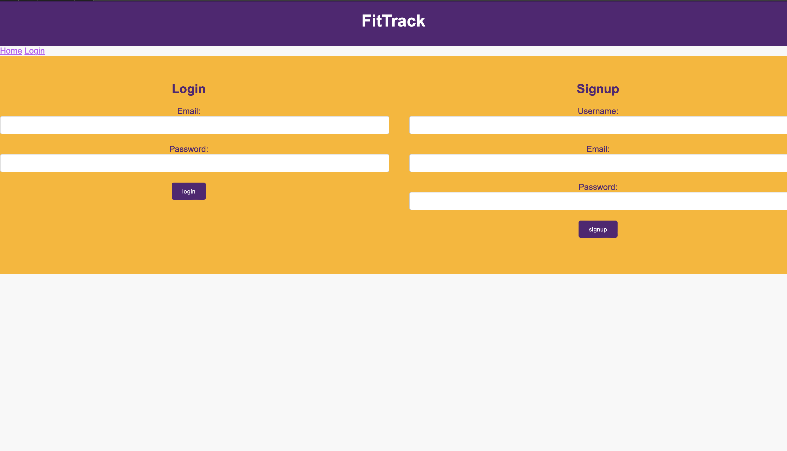

# PROJECT FitTrack

## DESCRIPTION:
This project is a full-stack fitness tracking application, allowing users to monitor their workouts and nutritional intake. Built using multiple front and back-end technologies, it allows users to track their fitness progress and optimize their routines. This application will showcase our skills based on the following requirements below:

## REQUIREMENTS:
- Use Node.js and Express.js to create a RESTful API
- Use Handlebars.js as the template engine
- Use MySQL and the Sequelize ORM for the database
- Have both GET and POST routes for retrieving and adding new data
- Use at least one new library, package, or technology that we haven’t discussed
- Have a folder structure that meets the MVC paradigm
- Include authentication (express-session and cookies)
- Protect API keys and sensitive information with environment variables
- Be deployed using Heroku (with data)
- Have a polished UI
- Be responsive
- Be interactive (in other words, accept and respond to user input)
- Meet good-quality coding standards (file structure, naming conventions, follows best practices for class/id naming conventions, indentation, quality comments, and so on)
- Have a professional README (with unique name, description, technologies used, screenshot, and link to deployed application)

## USER STORY:
- AS A fitness enthusiast
- I WANT TO track my workouts and supplemental intake
- SO THAT I can monitor my progress and optimize my fitness routine for better results

## LINKS:
- Link to github repository for this project: https://github.com/FriedLikeRice/FitTrack
- Link to deployed application: 

## RESOURCES:

Screenshot of deployed application: 